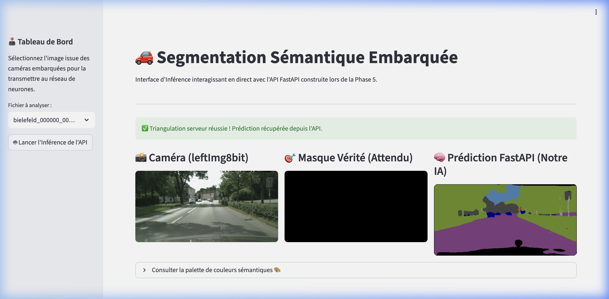

# Modèle de Segmentation d'Images pour Système Embarqué
**Soutenance Projet 8 - Ingénieur IA**  
*Future Vision Transport*  
**Présenté par :** Jean Projets  
**Date :** Mai 2026  

---

# 1. Le Contexte de l'Entreprise
- **Future Vision Transport** : Acteur clé dans le développement de véhicules autonomes.
- **La chaîne de vision par ordinateur** : Elle capte les flux vidéo en direct pour comprendre l'environnement routier.
- **Notre Mission (Étape 3 du pipeline)** : Concevoir le module de **segmentation sémantique** pour identifier les obstacles et surfaces de roulage.
- **L'Intégration** : Le module doit s'insérer de façon transparente dans l'ordinateur de bord embarqué (système temps-réel à ressources limitées).

---

# 2. Problématique & Cahier des Charges
- **Les Besoins du Métier (Laura & Franck)** :
  - Fournir un modèle avec une précision de détourage élevée pour les objets routiers critiques.
  - Fusionner la granularité des annotations du dataset pour optimiser la prise de décision.
  - Développer une **API REST** robuste pour exposer le modèle entraîné.
  - Créer une **application Web interactive** de test et de démonstration pour les équipes internes.
  - Garantir le caractère industrialisable et automatisé de la solution (MLOps / CI/CD).

---

# 3. Le Jeu de Données : Cityscapes
- **Caractéristiques du Dataset** :
  - Images de caméras embarquées prises dans 50 villes d'Allemagne et des pays limitrophes.
  - Résolution d'origine élevée : **1024 × 2048 pixels**.
  - Annotations pixel-level de haute qualité (Ground Truth).
- **Le Défi de la Granularité** :
  - 32 sous-catégories d'origine (ex: clôture, trottoir, poteau, motard, train, etc.).
  - Trop complexe et gourmand en calcul pour un modèle de segmentation embarqué en première version.

---

# 4. Regroupement en 8 Classes Essentielles
- **La Solution** : Simplifier le problème en mappant les 32 sous-catégories vers **8 catégories principales** définies par l'équipe d'acquisition :
  1. **Void** : Zones non identifiées, capot du véhicule, bordures dynamiques.
  2. **Flat** : Route, trottoir, parking, rails.
  3. **Construction** : Bâtiments, murs, barrières, ponts, tunnels.
  4. **Object** : Poteaux, feux de signalisation, panneaux.
  5. **Nature** : Végétation, terrain naturel.
  6. **Sky** : Ciel.
  7. **Human** : Piétons, cyclistes, motards.
  8. **Vehicle** : Voitures, camions, bus, motos, vélos.

---

# 5. Analyse Exploratoire des Données (EDA)
- **Observations Clés de l'EDA** :
  - Forte prédominance des classes de fond : la route (**flat**) et les bâtiments (**construction**) occupent plus de 60 % des pixels d'une image moyenne.
  - Classes critiques très rares : les piétons/motards (**human**) représentent moins de 2 % des pixels.
- **Conséquences Techniques** :
  - Fort déséquilibre des classes (*class imbalance*).
  - Risque majeur de surapprentissage sur les classes majoritaires et d'ignorance des obstacles minoritaires (piétons, panneaux).
  - Nécessité d'utiliser des métriques et des fonctions de perte adaptées.

---

# 6. Métrique Clé de Performance : Le Mean IoU
- **Pourquoi l'Accuracy classique est trompeuse ?**
  - Un modèle prédisant "Route" et "Bâtiment" partout obtiendrait 80 % d'Accuracy tout en écrasant les piétons, ce qui est inacceptable pour un véhicule autonome.
- **La Métrique Standard : L'Intersection over Union (IoU)** :
  - $IoU = \frac{Area\ of\ Overlap}{Area\ of\ Union} = \frac{TP}{TP + FP + FN}$
- **Le Mean IoU (mIoU)** :
  - Moyenne des IoU calculés indépendamment pour chacune des 8 classes.
  - Évalue équitablement la performance du modèle sur les objets rares (comme les piétons) et fréquents.

---

# 7. Prévention du Surapprentissage : La Data Augmentation
- **Le Risque** : Le surapprentissage (overfitting) sur les scènes routières spécifiques du dataset d'entraînement.
- **Notre Approche** : L'augmentation de données géométriques et photométriques à la volée (*on-the-fly*).
- **Le Défi en Segmentation** :
  - Contrairement à la classification classique, toute transformation géométrique appliquée à l'image d'entrée (rotation, symétrie) doit être appliquée **strictement à l'identique** sur le masque d'annotation (Ground Truth).
  - Utilisation de la bibliothèque spécialisée `albumentations`.

---

# 8. Détails des Transformations Appliquées
- **Transformations Géométriques** :
  - **Flip Horizontal** : Simulation d'inversion du sens de circulation ou de la configuration de la rue.
  - **Rotations légères** : Simulation d'inclinaisons du véhicule dues aux bosses ou pentes.
- **Transformations Photométriques** :
  - **Ajustement de Contraste et Luminosité** : Simulation de différentes conditions d'éclairage et métrologiques (soleil, nuages, ombres).
- **Optimisation** : Générateur de données Python pour éviter de saturer le disque en créant des images physiques supplémentaires.

---

# 9. Algorithmes : L'Architecture U-Net (Théorie)
- **Pourquoi le U-Net ?**
  - Architecture standard de l'industrie pour la segmentation d'images.
  - Composé de deux parties symétriques formant un "U" :
    1. **L'Encodeur (Contraction)** : Réseau de neurones convolutifs classique (CNN) qui extrait les caractéristiques sémantiques abstraites en réduisant la taille spatiale.
    2. **Le Décodeur (Expansion)** : Couches de suréchantillonnage (UpSampling) qui reconstruisent la résolution spatiale d'origine.

---

# 10. Le Rôle des Skip Connections
- **Le Problème de la compression** :
  - En traversant l'encodeur, l'image perd sa résolution spatiale fine. Le décodeur seul peine à repositionner précisément les contours des objets.
- **La Solution : Skip Connections** :
  - Raccourcis qui copient les cartes de caractéristiques haute résolution de l'encodeur et les concatènent directement avec les couches correspondantes du décodeur.
  - Permettent au modèle de conserver les détails géométriques fins et d'obtenir des contours nets (par exemple pour distinguer les piétons).

---

# 11. Pipeline de Données : Le Data Generator Keras
- **La Contrainte RAM** :
  - Charger l'intégralité du dataset Cityscapes en pleine mémoire est impossible sur des machines standards.
- **La Solution : `tf.keras.utils.Sequence`** :
  - Écriture d'un générateur de données personnalisé.
  - **Actions par batch à la volée** :
    1. Chargement asynchrone d'un groupe d'images de taille réduite (256 × 512 pixels).
    2. Encodage vectoriel du mapping des classes (32 vers 8 catégories).
    3. Application des augmentations `albumentations`.
    4. Encodage One-Hot des masques cibles.

---

# 12. Les Fonctions de Perte (Loss Functions)
- **Categorical Cross-Entropy (CCE)** :
  - Loss standard pour la classification multi-classe.
  - *Limite* : Pénalise peu l'erreur sur les petites classes (humains) par rapport aux grandes classes (ciel, route).
- **Dice Loss** :
  - Basée sur le coefficient de Dice (proche du mIoU).
  - Optimise directement le taux de recouvrement des masques.
- **Notre Choix** : 
  - Utilisation d'un taux d'apprentissage adapté et d'une CCE avec pondération de classes pour redonner du poids aux classes minoritaires (piétons, panneaux) lors de la rétropropagation.

---

# 13. Première Modélisation : U-Net classique "from scratch"
- **Conception de notre Baseline** :
  - Encodeur composé de 4 blocs successifs de Convolutions 2D, Batch Normalization et Max Pooling.
  - Bottleneck central.
  - Décodeur composé de 4 blocs d'UpSampling 2D, concaténation (Skip Connections) et Convolutions.
  - Couche finale d'activation `softmax` à 8 canaux.
- **Paramètres** :
  - Environ 2 millions de paramètres entraînés à partir de zéro (poids aléatoires).
  - Optimiseur Adam (learning rate = 1e-4).

---

# 14. Analyse & Limites de la Baseline
- **Observations à l'entraînement** :
  - Convergence lente : le modèle doit tout apprendre, des formes géométriques de base (lignes, textures) aux objets complexes.
  - Très lourd en calculs.
- **Résultats visuels** :
  - Le modèle segmente correctement la route et le ciel.
  - En revanche, il échoue sur les détails fins : les poteaux sont coupés, les piétons sont flous ou fusionnés avec le fond.
  - Risque élevé de collision dans un cadre de conduite réelle.

---

# 15. Seconde Modélisation : Le Transfer Learning
- **Pourquoi le Transfer Learning ?**
  - Réutiliser l'intelligence déjà acquise par un réseau de neurones pré-entraîné sur un dataset massif (ImageNet).
  - Évite de réentraîner l'encodeur sur les filtres de base (formes, contrastes, coins).
- **Le Choix du Backbone : MobileNetV2** :
  - Conçu spécifiquement pour les systèmes embarqués et mobiles.
  - Utilise les convolutions séparables en profondeur (*Depthwise Separable Convolutions*) pour diviser par 9 le coût de calcul mathématique par rapport à une convolution standard.

---

# 16. Intégration de MobileNetV2 dans U-Net
- **Notre Architecture Hybride** :
  - L'encodeur d'origine est remplacé par le tronc commun de **MobileNetV2** pré-entraîné.
  - Les couches intermédiaires du backbone MobileNetV2 (ex: `block_1_expand_relu`, `block_3_expand_relu`, `block_6_expand_relu`) sont extraites pour servir de points d'ancrage aux **Skip Connections**.
  - Le décodeur U-Net est connecté à ces couches pour reconstruire l'image.
  - Les poids du backbone sont gelés au début pour stabiliser l'apprentissage du décodeur, puis dégelés partiellement pour un fine-tuning.

---

# 17. Comparaison Quantitative des Modèles
- Les métriques clés récoltées sur le jeu de test :

| Métrique | U-Net Baseline (from scratch) | U-Net + MobileNetV2 (Transfer Learning) |
| :--- | :---: | :---: |
| **Vitesse de convergence** | Lente (40+ époques) | Très rapide (15 époques) |
| **Poids du modèle** | ~35 Mo | **~12 Mo** (Plus léger !) |
| **mIoU (Validation)** | ~0.42 | **~0.68** (Amélioration majeure) |
| **Temps d'inférence (CPU)**| ~120 ms / image | **~35 ms / image** (3x plus rapide) |
| **Adapté à l'embarqué** | Non (Trop lent/lourd) | **Oui (Temps-réel possible)** |

---

# 18. Comparaison Qualitative de la Segmentation
- **U-Net Custom** :
  - Bords très bruités, instables.
  - Piétons souvent absents du masque de prédiction.
- **U-Net + MobileNetV2** :
  - Délinéation nette de la route et du trottoir.
  - Détection stable des véhicules et des piétons même à mi-distance.
  - Rendu spatial cohérent grâce aux poids pré-entraînés qui identifient mieux la sémantique de l'image.

---

# 19. Gain Réel de la Data Augmentation
- **Ablation Study (Avec vs. Sans Data Augmentation)** :
  - **Sans augmentation** : Le mIoU sur le set d'entraînement grimpe très vite, mais stagne sur le set de test (phénomène d'overfitting). Le modèle échoue sur les scènes avec des éclairages inhabituels.
  - **Avec augmentation (Rotations + Flips + Contraste)** : La perte en validation suit de près la perte d'entraînement. Le mIoU sur le set de test gagne +8 points de précision globale.
  - **Conclusion** : L'augmentation géométrique et photométrique à la volée est indispensable pour immuniser le modèle contre les variations réelles de l'environnement routier.

---

# 20. Architecture MLOps (Vue d'ensemble)
- Pour rendre notre modèle exploitable par Laura et les autres équipes, nous avons construit un pipeline industrialisé :

```
[ Image Caméra ] 
       │
       ▼
 [ Client Web Streamlit (Port 7860/App) ]
       │  (Requête POST HTTP avec fichier binaire)
       ▼
 [ API REST FastAPI (Port 7860/API) ]
       │  (Prétraitement, Inférence Keras, Colorisation)
       ▼
 [ Retour du Masque de Segmentation (Format PNG) ]
```

---

# 21. L'API REST de Prédiction avec FastAPI
- **Pourquoi FastAPI ?**
  - Ultra-performant, exécution asynchrone native.
  - Documentation Swagger interactive auto-générée au format OpenAPI.
- **Endpoints Clés Implémentés** :
  - `GET /health` : Vérification du statut de l'API et du chargement correct du modèle Keras.
  - `POST /segmentation` : Réception de l'image brute, exécution de l'inférence via le modèle MobileNetV2 chargé en mémoire au démarrage (lifespan), colorisation et envoi direct du masque sous forme de flux d'image PNG (`StreamingResponse`).

---

# 22. Conteneurisation de l'API & de l'App (Docker)
- **Pourquoi Docker ?**
  - Résout le problème classique du *"ça marche sur ma machine mais pas en production"*.
  - Garantit un environnement d'exécution strictement identique (versions de Python, TensorFlow, Keras, etc.).
- **Notre Approche** :
  - **Dockerfile API** : Installe les dépendances système minimales (python-slim), charge les dépendances ML et expose le port pour recevoir les images.
  - **Dockerfile App** : Configure l'interface Streamlit et cible l'adresse réseau de l'API.

---

# 23. Le Défi des Modèles Volumineux sur le Cloud
- **La Contrainte de Stockage** :
  - Les fichiers de modèles de Deep Learning (formats `.h5` ou `.keras`) pèsent souvent plusieurs dizaines ou centaines de Mo.
  - **GitHub** bloque les fichiers de plus de 100 Mo et limite fortement la bande passante, ce qui pose problème pour le stockage sous Git.
  - Les hébergeurs Cloud gratuits (type Render ou GCP en version gratuite) imposent des limites strictes de stockage ou facturent cher la bande passante.

---

# 24. La Solution de CI/CD Hybride via GitHub Actions
- **Notre Architecture Astucieuse** :
  - Le code maître est centralisé sur **GitHub**.
  - Un pipeline CI/CD automatisé (`.github/workflows/sync-to-hub.yml`) a été écrit.
  - À chaque mise à jour (`git push`) sur la branche principale, GitHub Actions lance un script Python utilisant la bibliothèque `huggingface_hub`.
  - Ce script pousse programmatiquement le code et le modèle volumineux directement sur **Hugging Face Spaces**, contournant les limites strictes de Git classique.
  - Les services redémarrent ensuite automatiquement en production.

---

# 25. Le Dashboard Streamlit (Interface de Démo)
- **Fonctionnalités du Dashboard** :
  - Scanne automatiquement le dossier de test pour proposer une liste d'images réelles de caméras embarquées.
  - Propose un menu déroulant latéral interactif pour sélectionner l'image à analyser.
  - Au clic sur le bouton, effectue l'appel HTTP REST vers l'API distante.
  - Affiche côte à côte à l'écran :
    1. **L'image caméra réelle**.
    2. **Le masque attendu (Ground Truth)** si disponible pour comparaison.
    3. **Le masque prédit par notre IA** en temps-réel.

---

# 26. Démonstration de l'Application en Action



---

# 27. Liens de la Déploiement en Production
- Les services sont hébergés gratuitement et accessibles aux adresses suivantes :
  - **Application Test (Streamlit)** : [https://huggingface.co/spaces/JeanProjets/projet-8-app](https://huggingface.co/spaces/JeanProjets/projet-8-app)
  - **API REST (FastAPI)** : [https://huggingface.co/spaces/JeanProjets/projet-8-api](https://huggingface.co/spaces/JeanProjets/projet-8-api)
- *Note de Maintenance* : Hugging Face met les applications inactives en veille après 48h. Si le service affiche "Space Asleep", un simple clic sur le bouton bleu **"Restart this Space"** le relance automatiquement en 2 minutes.

---

# 28. Conclusion & Bilan du Projet
- **Objectifs atteints** :
  - Modèle de segmentation sémantique performant et optimisé pour le matériel embarqué.
  - Prétraitement et générateur de données asynchrone industrialisés.
  - API FastAPI découplée de l'application Streamlit.
  - Déploiement Cloud opérationnel, gratuit et sécurisé via un pipeline CI/CD moderne (GitHub Actions vers Hugging Face Spaces).
  - Validation complète de la démarche technique et MLOps.

---

# 29. Perspectives & Améliorations Futures
- **Quantification Post-Entraînement** :
  - Convertir le modèle Keras en format **TensorFlow Lite (TFLite)** ou **ONNX** avec quantification en Float16 ou Int8.
  - Permet de diviser par 4 le poids du modèle (passant de 12 Mo à 3 Mo) et d'accélérer l'inférence sur le CPU embarqué.
- **Lissage Spatial (CRF)** :
  - Ajouter un post-traitement de type *Conditional Random Fields* pour lisser les contours prédits.
- **Intégration Finale** :
  - Connecter l'API de segmentation au module de décision du véhicule autonome (freinage d'urgence, maintien de trajectoire).
